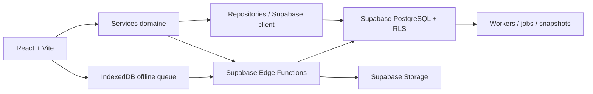

# Samay Keur

Samay Keur est une plateforme SaaS multi-tenant de gestion immobiliere pour agences, bailleurs et equipes de gestion locative en Afrique francophone.

Le produit centralise les operations locatives critiques : patrimoine, locataires, contrats, encaissements, reliquats, commissions, documents, reporting, equipe, permissions, stockage documentaire et workflows terrain.

Production : https://samay-keur-gestion-locative.vercel.app

---

## Vision produit

Samay Keur transforme une gestion locative dispersee entre Excel, WhatsApp, fichiers PDF et relances manuelles en une infrastructure metier structuree.

Objectifs :

- fiabiliser les encaissements et les soldes locatifs ;
- produire des documents professionnels et verifiables ;
- donner aux agences une GED simple, securisee et economique ;
- fonctionner avec des connexions instables grace a une logique offline-first ;
- proteger les donnees par agence avec RLS, RBAC et Edge Functions ;
- offrir une experience premium mobile-first pour le terrain.

---

## Capacites principales

### Gestion locative

- Bailleurs, immeubles, unites, locataires.
- Contrats, mandats, resiliations, cycles de vie metier.
- Paiements, loyers impayes, paiements partiels, reliquats et avances.
- Commissions agence, reversements bailleurs et tableaux de bord.
- Interventions, inventaires, calendrier et activites.

### Finance

- Ledger append-only.
- Paiements idempotents via Edge Functions.
- Reliquats calcules cote serveur.
- Commissions separees du montant paye par le locataire.
- Exports comptables certifies.
- Reconciliation et monitoring du drift financier.

### Documents et GED

- Generation de contrats, mandats, quittances, factures et rapports.
- Registre documentaire avec `data_hash`, `file_hash`, versioning et statuts.
- Reutilisation des documents deja generes quand les donnees n'ont pas change.
- Stockage prive Supabase par agence.
- Quotas par plan et maintenance non destructive.
- QR codes de verification documentaire.

### SaaS enterprise

- Multi-tenant par agence.
- Roles : `super_admin`, `admin`, `agent`, `comptable`, `bailleur`.
- Permissions dynamiques par utilisateur et par page.
- Console super-admin.
- Abonnements PayDunya.
- Pricing par valeur metier, stockage, collaboration et gouvernance.

### Mobile et offline-first

- Interface mobile terrain.
- IndexedDB pour cache local, backup et mutations en attente.
- Replay de la queue offline a la reconnexion.
- Etats reseau visibles et experience stable en connexion degradee.

---

## Architecture en bref



Regle de production : les operations sensibles ne doivent pas etre ecrites directement depuis le client. Paiements, contrats critiques, abonnements, ledger, QR verification et documents prives passent par une Edge Function, une RPC securisee ou une policy RLS explicite.

---

## Stack

- React 18, TypeScript, Vite 5.
- TailwindCSS, Framer Motion, Recharts.
- Supabase Auth, PostgreSQL, RLS, Edge Functions Deno, Storage.
- IndexedDB pour offline-first.
- PayDunya pour Wave, Orange Money, Djamo et carte.
- Resend, Orange SMS API.
- Sentry, PostHog.
- Vercel.

---

## Lancer le projet

```bash
npm install
npm run dev
```

Preview production locale :

```bash
npm run build
npm run preview -- --host 127.0.0.1 --port 4175
```

Checks recommandes avant push :

```bash
npm run typecheck
npm run lint
npm run build
```

Tests :

```bash
npm run test
npm run test:unit
```

Les variables d'environnement attendues sont documentees dans `.env.example`.

---

## Documentation

La documentation detaillee est maintenant separee par responsabilite.

| Sujet | Document |
|---|---|
| Architecture globale | [docs/architecture.md](docs/architecture.md) |
| Securite | [docs/security.md](docs/security.md) |
| Finance engine | [docs/finance-engine.md](docs/finance-engine.md) |
| Paiements | [docs/payments.md](docs/payments.md) |
| Offline-first | [docs/offline-first.md](docs/offline-first.md) |
| GED et stockage | [docs/document-storage.md](docs/document-storage.md) |
| RBAC et multi-tenant | [docs/rbac.md](docs/rbac.md) |
| Edge Functions | [docs/edge-functions.md](docs/edge-functions.md) |
| Deploiement | [docs/deployment.md](docs/deployment.md) |
| Monitoring | [docs/monitoring.md](docs/monitoring.md) |
| Roadmap | [docs/roadmap.md](docs/roadmap.md) |
| Contribution | [docs/contributing.md](docs/contributing.md) |
| Design system | [docs/DESIGN_SYSTEM.md](docs/DESIGN_SYSTEM.md) |
| Brand guidelines | [docs/BRAND_GUIDELINES.md](docs/BRAND_GUIDELINES.md) |

Les anciens documents de suivi et historiques restent archives dans [docs/historique](docs/historique).

---

## Maturite actuelle

Etat : beta avancee stabilisee.

Dernieres verifications locales connues :

- `npm run typecheck` : OK
- `npm run lint` : OK
- `npm run build` : OK
- scan mojibake UTF-8 sur les fichiers touches : OK

Points d'attention production :

- Supabase CLI n'est pas toujours disponible localement ; certaines migrations peuvent devoir etre appliquees via CI ou l'editeur SQL Supabase.
- Les secrets exposes pendant les sessions de travail doivent etre rotates avant lancement commercial.
- Les documents legaux critiques ne doivent jamais etre supprimes brutalement : ils doivent etre archives, versionnes ou marques comme obsoletes.

---

## Licence

Projet prive. Toute utilisation, distribution ou deploiement hors du cadre autorise doit etre valide par l'equipe proprietaire.
