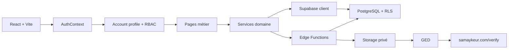

# Architecture globale

Samay Këur est une application React/Vite connectée à Supabase. Le frontend orchestre l'expérience utilisateur, mais les opérations sensibles restent côté serveur, Edge Function, RPC ou Postgres avec RLS.

## Vue logique

## Frontend

Zones principales :

- `src/pages` : pages métier et parcours utilisateur.
- `src/components` : layout, UI, tableaux, formulaires, navigation.
- `src/services` : accès métier, orchestration et helpers persistants.
- `src/hooks` : auth, permissions, réseau, fonctionnalités.
- `src/lib` : Supabase client, PDF, formatters et utilitaires partagés.
- `src/constants` : dictionnaires et configurations UI.

## Backend Supabase

Supabase porte :

- Auth ;
- tables métier ;
- RLS multi-tenant ;
- Storage privé ;
- Edge Functions ;
- registre documentaire ;
- fonctions RPC si nécessaires.

## Frontières critiques

| Domaine | Autorité attendue |
|---|---|
| Paiements | Edge Function ou service serveur idempotent |
| Ledger | Postgres/RPC/trigger, append-only quand applicable |
| Documents privés | Storage privé + registry + signed URLs |
| QR public | `samaykeur.com/verify` + Edge Function `verify-document` |
| Permissions | RLS + RBAC + guards UI |
| Abonnement | source serveur ou état d'abonnement vérifié |

## Profil de compte

Le type de compte et le rôle utilisateur sont deux notions distinctes.

Phase 1 :

- `is_bailleur_account = true` active le mode bailleur individuel ;
- fallback strict agence quand le champ est absent ou faux ;
- les composants consomment `accountProfile`, pas directement `is_bailleur_account`.

## Invariants

- Une agence ne lit jamais les données d'une autre agence.
- Un bailleur individuel n'a pas besoin de sélectionner un bailleur.
- Les calculs financiers ne sont pas corrigés par du code UI décoratif.
- Un document vérifiable doit avoir un type stable, une référence, un QR et une entrée de registre.
- Les secrets service role ne vont jamais dans le frontend.
