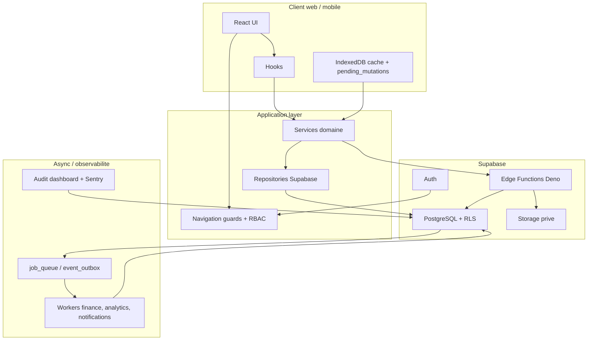
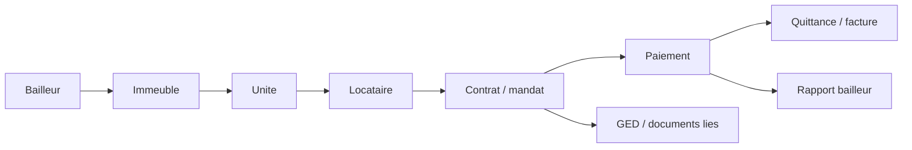

# Architecture

Samay Këur est une application SaaS multi-tenant construite autour d'un frontend React, d'un backend Supabase et d'une couche Edge Functions pour les operations sensibles.

## Objectifs d'architecture

- Isoler strictement les donnees par agence.
- Centraliser la logique financiere cote serveur.
- Garder un ledger append-only.
- Permettre le travail en connexion instable.
- Versionner les documents et eviter les doublons de stockage.
- Rendre les workflows metier maintenables.

## Vue globale

## Frontend

Principales zones :

- `src/pages` : pages produit.
- `src/components` : composants UI, layout, documents, billing.
- `src/services` : logique domaine, API, offline queue, document registry.
- `src/hooks` : hooks reseau, auth, permissions, colonnes.
- `src/lib` : utilitaires partages, PDF, Supabase client.

Le frontend peut afficher, filtrer, preparer et mettre en cache, mais ne doit pas devenir l'autorite pour les operations critiques.

## Backend Supabase

PostgreSQL porte :

- tables metier ;
- RLS multi-tenant ;
- constraints financieres ;
- fonctions RPC ;
- ledger ;
- jobs ;
- snapshots ;
- registry documentaire.

Edge Functions portent :

- controles d'autorisation ;
- validation des inputs ;
- idempotence ;
- appels fournisseurs ;
- ecritures serveur.

## Frontieres critiques

| Domaine | Autorite |
|---|---|
| Paiements loyers | Edge Function + Postgres |
| Ledger | Triggers/RPC serveur, append-only |
| Abonnements | PayDunya webhook + service role |
| Documents prives | Registry + Storage signed URLs |
| Permissions utilisateur | `user_page_permissions` + RLS |
| Offline replay | Queue locale + Edge Functions idempotentes |

## Flux metier immobilier

## Invariants d'architecture

- Une ligne financiere ne doit pas etre corrigee par update destructif.
- Une agence ne doit jamais lire les donnees d'une autre agence.
- Un document identique ne doit pas etre regenere inutilement.
- Une mutation offline doit etre rejouable sans double effet.
- Les workflows destructifs doivent devenir des workflows de lifecycle : resilier, archiver, suspendre, cloturer.
