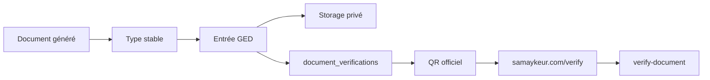

# GED et stockage documentaire

La GED de Samay Këur couvre documents générés, uploads, registre, stockage et vérification publique.

## Documents prioritaires

- quittance ;
- facture ;
- contrat ;
- mandat ;
- rapport bailleur ;
- rapport propriétaire ;
- export financier si activé.

## Chaîne documentaire cible



## Types documentaires

| Type | Usage |
|---|---|
| `quittance` | quittance de loyer |
| `facture` | facture ou reçu si distinct |
| `contrat` | contrat de location |
| `mandat` | mandat de gérance |
| `rapport_bailleur` | rapport propriétaire/agence vérifiable |
| `rapport` | compatibilité ancienne |

`rapport_bailleur` doit être accepté par le registre de vérification.

## QR public

Format obligatoire pour les nouveaux documents :

```txt
https://samaykeur.com/verify?token=...&ref=...&type=...
```

Fallback côté génération :

1. `VITE_PUBLIC_VERIFY_BASE_URL`
2. `https://samaykeur.com`

Ne pas utiliser `window.location.origin` ou `app.samaykeur.com` pour les QR imprimés.

## Sécurité stockage

- bucket privé ;
- chemins préfixés par agence ;
- signed URLs pour accès privé ;
- page `/verify` publique limitée aux métadonnées autorisées ;
- pas d'URL Storage privée dans la vitrine.

## Tests minimum

- générer quittance, contrat, mandat, rapport bailleur ;
- vérifier type, référence, QR, registre ;
- ouvrir l'URL `/verify` ;
- vérifier statut authentique/introuvable/révoqué/remplacé.
