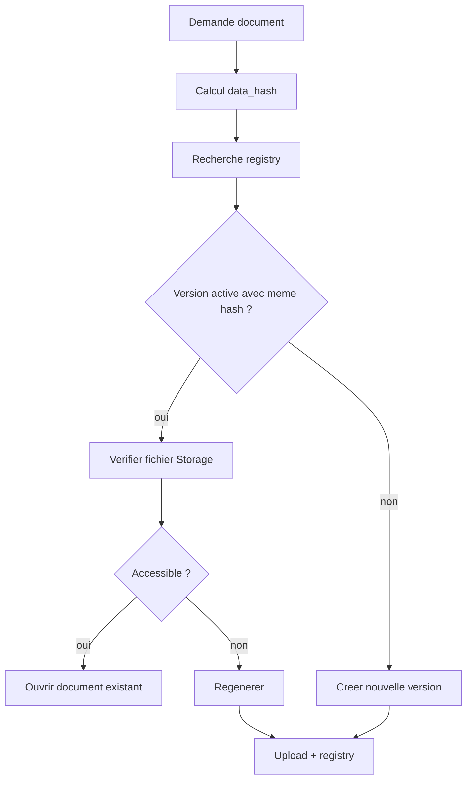

# GED et stockage documentaire

Samay Keur utilise une GED legere pour differencier documents generes, documents uploades et archives.

## Objectifs

- Eviter les doublons.
- Reutiliser les documents deja generes.
- Versionner quand les donnees changent.
- Controler les couts Storage.
- Respecter le multi-tenant.
- Proteger les documents critiques.

## Types de documents

### Documents generes

- contrats ;
- mandats ;
- quittances ;
- factures ;
- rapports bailleurs ;
- exports PDF/CSV/Excel.

### Documents uploades

- CNI ;
- justificatifs ;
- assurances ;
- documents administratifs ;
- actes ;
- photos ;
- archives.

## Stockage

Structure cible :

```text
documents/
  agencies/{agency_id}/
    contrats/{year}/{month}/
    mandats/{year}/{month}/
    quittances/{year}/{month}/
    factures/{year}/{month}/
    rapports-bailleurs/{year}/{month}/
    exports/{year}/{month}/
    uploads/{category}/{year}/{month}/
```

## Document registry

Le registre documentaire doit suivre :

- `agency_id`
- `document_type`
- `document_scope`
- `document_category`
- `entity_type`
- `entity_id`
- `period`
- `reference`
- `version`
- `storage_path`
- `file_hash`
- `data_hash`
- `generated_at`
- `generated_by`
- `status`
- `file_size`
- `mime_type`
- `retention_policy`
- `last_accessed_at`

## Idempotence documentaire



## Quotas par plan

| Plan | Stockage |
|---|---:|
| Starter | 1 Go |
| Pro | 20 Go |
| Business | 100 Go |
| Enterprise | Sur mesure / fair usage |

## Lifecycle

Statuts :

- `active`
- `archived`
- `orphaned`
- `corrupt`
- `deleted`

Retention :

- `critical`
- `standard`
- `temporary`

Regle : un document legal critique ne doit pas etre supprime brutalement.

## Maintenance

Actions non destructives :

- archiver les anciennes versions ;
- marquer les orphelins ;
- nettoyer les previews temporaires ;
- compresser les images uploades ;
- signaler les fichiers lourds ;
- proposer upgrade si quota proche.

## Securite

- Bucket prive.
- Signed URLs.
- Prefixe par agence.
- RLS sur registry.
- Verification serveur avant ouverture.
