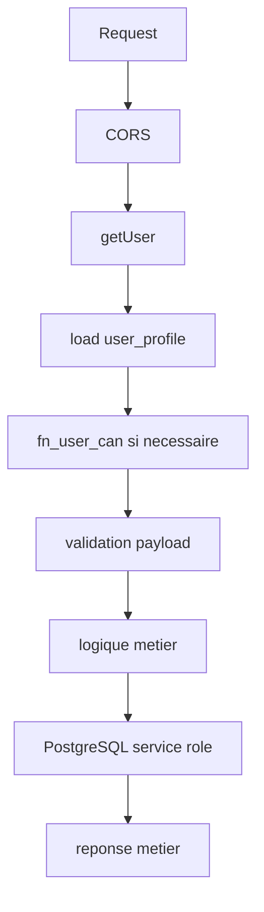

# Edge Functions

Les Edge Functions sont la couche d'autorite pour les operations sensibles.

## Fonctions principales

| Fonction | Role |
|---|---|
| `create-paiement` | creer un encaissement locatif |
| `update-paiement` | modifier un paiement selon regles metier |
| `cancel-paiement` | annuler/reverser un paiement |
| `create-contrat` | creer un contrat cote serveur |
| `update-contrat` | modifier ou resilier un contrat |
| `update-bailleur-lifecycle` | lifecycle bailleur |
| `initiate-payment` | initialiser PayDunya |
| `paydunya-webhook` | valider webhook paiement abonnement |
| `verify-document` | verifier QR documentaire |
| `export-accounting-ledger` | generer export comptable |
| `analytics-worker` | jobs analytics |
| `finance-worker` | jobs finance |
| `notification-worker` | notifications |
| `subscription-scheduler` | abonnements |
| `send-email` | email transactionnel |
| `send-sms` | SMS |

## Pattern recommande



## Regles

- Ne jamais utiliser service role avant auth + validation.
- Retourner des erreurs metier comprehensibles.
- Ne pas exposer les details internes.
- Journaliser les erreurs inattendues.
- Garder l'idempotence sur les operations rejouables.
- Refuser les actions hors agence.

## Variables d'environnement

Voir `.env.example` et les secrets Supabase/Vercel :

- Supabase URL et keys ;
- PayDunya keys ;
- Resend ;
- Orange SMS ;
- URL publique frontend ;
- Sentry/PostHog si actives.

## Deploiement fonctions

Utiliser Supabase CLI ou pipeline CI :

```bash
supabase functions deploy create-paiement
supabase functions deploy paydunya-webhook
```

Si la CLI n'est pas disponible localement, deployer depuis l'environnement CI ou Supabase Dashboard selon le workflow equipe.
