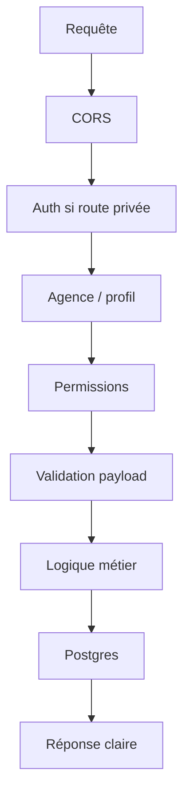

# Edge Functions

Les Edge Functions sont la couche serveur pour les opérations sensibles ou publiques contrôlées.

## Fonctions prioritaires

| Fonction | Rôle |
|---|---|
| `verify-document` | vérification publique d'un QR documentaire |
| `create-paiement` | création serveur d'un paiement |
| `update-paiement` | modification contrôlée d'un paiement |
| `cancel-paiement` | annulation ou correction contrôlée |
| `initiate-payment` | initiation abonnement/paiement externe |
| `paydunya-webhook` | validation webhook paiement |
| `send-email` | email transactionnel |
| `send-sms` | SMS transactionnel si activé |

## Pattern recommandé



`verify-document` est public, mais doit limiter les données retournées.

## Vérification documentaire

Entrées supportées :

- `token`
- `ref`
- `type`

États attendus :

- authentique ;
- introuvable ;
- révoqué ;
- remplacé ;
- erreur réseau/serveur.

## Déploiement

Déployer avec Supabase CLI ou pipeline CI :

```bash
supabase functions deploy verify-document
```

Ne jamais mettre de clé service role dans le code frontend ou vitrine.
