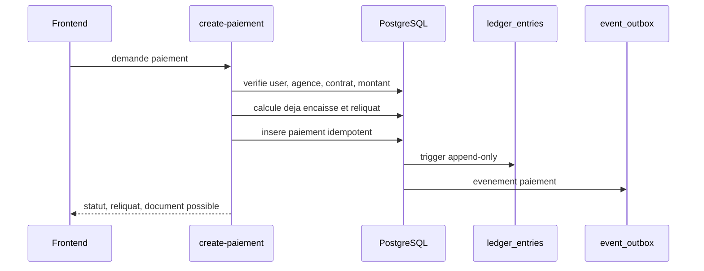
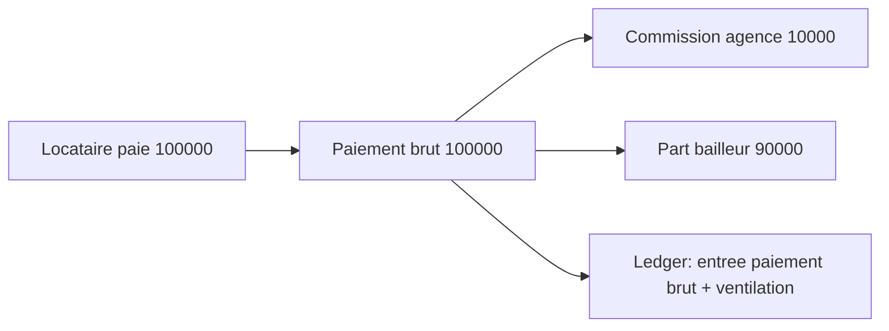

# Finance engine

Le finance engine garantit que les paiements, reliquats, commissions et rapports restent coherents, tracables et compatibles avec une architecture append-only.

## Principes comptables

- Le montant paye par le locataire est le montant brut encaisse.
- La commission agence est derivee du montant encaisse ; elle ne s'ajoute jamais au paiement locataire.
- Le bailleur recoit le net apres commission.
- Le ledger est append-only.
- Les corrections passent par annulation, reversal ou nouvelle ecriture.
- Les calculs d'impayes se basent sur les echeances reelles, pas sur le nombre de lignes ledger.

## Flux paiement loyer



## Paiements partiels

Exemple :

| Etape | Loyer attendu | Paiement | Total encaisse | Reliquat | Statut |
|---|---:|---:|---:|---:|---|
| 1 | 100000 | 40000 | 40000 | 60000 | partiel |
| 2 | 100000 | 30000 | 70000 | 30000 | partiel |
| 3 | 100000 | 30000 | 100000 | 0 | paye |

Le reliquat est calcule cote serveur a partir :

- du contrat ;
- de la periode ;
- du montant attendu ;
- du total deja encaisse ;
- du nouveau paiement valide.

## Surpaiement

La detection de surpaiement ne doit utiliser que les vrais encaissements du locataire pour l'echeance cible.

Sont exclus du calcul :

- commissions agence ;
- reversements bailleurs ;
- charges internes ;
- lignes ledger techniques ;
- exports ;
- corrections non encaissees.

## Commissions



Invariant : paiement total enregistre = montant locataire, pas montant locataire + commission.

## Impayes

Les impayes doivent etre derives des echeances :

```text
montant_du = montant_attendu - total_encaisse_reel
```

Statuts attendus :

- `a_venir`
- `partiel`
- `en_retard`
- `paye`
- `paye_en_avance`

## Ledger append-only

Le ledger doit rester immutable :

- pas d'update ;
- pas de delete ;
- corrections par ecritures compensatoires ;
- reconciliation mensuelle via snapshots.

## Monitoring finance

Indicateurs a surveiller :

- drift paiements vs ledger ;
- jobs finance failed ;
- transactions PayDunya pending > 24h ;
- ecarts de reliquat ;
- exports comptables generes ;
- annulations/reversals.
