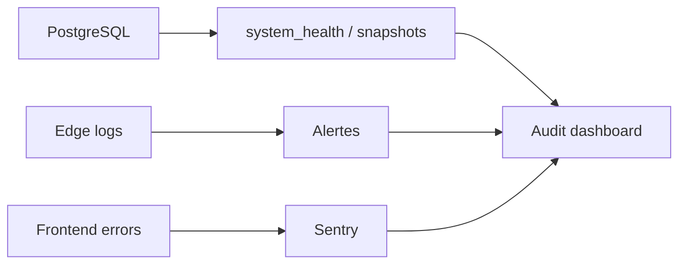

# Monitoring

Le monitoring doit couvrir la stabilite applicative, la finance, les jobs, les webhooks, le stockage et l'experience utilisateur.

## Surfaces

- Sentry : erreurs frontend.
- Supabase logs : Edge Functions, DB.
- Audit dashboard : sante systeme, finance, jobs.
- PostHog : analytics produit si active.
- Vercel logs : build, runtime, routing.

## Indicateurs critiques

| Domaine | Signal |
|---|---|
| Finance | ledger drift, exports, reversals |
| Jobs | pending, stuck, failed |
| Webhooks | PayDunya pending > 24h, erreurs hash |
| Storage | quota, fichiers lourds, orphelins |
| Offline | pending mutations, sync failures |
| Security | refus RLS, permissions refusees |
| UX | erreurs JS, pages blanches, temps chargement |

## Dashboard systeme

## Alertes recommandees

- Page blanche ou erreur JS critique.
- `ledger_drift > 0`.
- `job_queue failed > 0`.
- webhook PayDunya invalide repete.
- Storage > 80% quota.
- pending mutations qui ne diminuent pas.
- erreur RLS bloquante sur route critique.

## Runbooks

Voir :

- [runbooks/INCIDENT_JS_ERRORS.md](runbooks/INCIDENT_JS_ERRORS.md)
- [runbooks/INCIDENT_RLS_BLOCKING.md](runbooks/INCIDENT_RLS_BLOCKING.md)
- [runbooks/DEPLOYMENT.md](runbooks/DEPLOYMENT.md)
