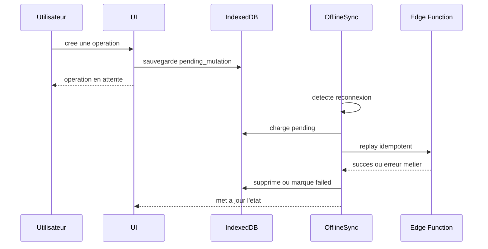

# Offline-first

L'architecture offline-first permet aux utilisateurs de continuer a travailler avec une connexion lente, instable ou absente.

## Objectifs

- Ne pas perdre les saisies.
- Permettre la consultation des donnees recentes.
- Mettre les mutations critiques en attente.
- Rejouer les operations de maniere idempotente.
- Afficher clairement l'etat de synchronisation.

## Composants

| Composant | Role |
|---|---|
| `src/services/db.ts` | Wrapper IndexedDB |
| `src/services/offlineQueue.ts` | Queue des mutations |
| `src/services/localBackup.ts` | Sauvegarde locale |
| `src/hooks/useOfflineSync.ts` | Detection reseau et replay |
| `NetworkBanner` | Feedback utilisateur |
| `BackupIndicator` | Etat backup/sync |

## Flux de synchronisation

## Types de mutation

Prioritaires :

- paiements ;
- modifications de donnees metier ;
- generation de brouillons ;
- actions lifecycle.

Les operations financieres doivent toujours rejouer vers une Edge Function, jamais directement vers une table.

## Gestion conflits

Strategie actuelle :

- privilegier l'autorite serveur ;
- garder la mutation locale si l'erreur est reseau ;
- marquer failed si l'erreur est metier ;
- afficher une action utilisateur quand une decision est necessaire.

## Idempotence

Chaque mutation rejouable doit porter :

- un identifiant client stable ;
- le type d'operation ;
- l'agence ;
- l'utilisateur ;
- la payload ;
- le nombre de tentatives ;
- le statut.

## UX offline

Bon comportement :

- message clair ;
- pas de reset de formulaire ;
- boutons desactives seulement si l'action est vraiment impossible ;
- reprise automatique ;
- feedback apres synchronisation.

Mauvais comportement :

- erreur technique brute ;
- suppression de la saisie ;
- blocage total de la page ;
- double operation silencieuse.
