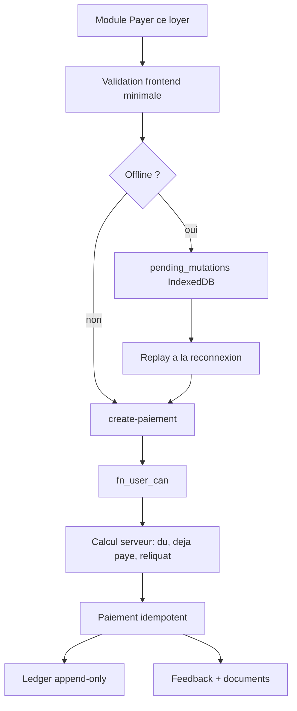

# Paiements

Les paiements couvrent deux familles : encaissements locatifs et abonnements SaaS.

## Encaissements locatifs

Operations :

- paiement complet ;
- paiement partiel ;
- regularisation ;
- avance ;
- annulation ;
- modification controlee.

Fonctions principales :

- `create-paiement`
- `update-paiement`
- `cancel-paiement`

## Flux d'encaissement

## Regles metier

- Les paiements partiels sont autorises.
- Un paiement ne doit pas creer de reliquat negatif non controle.
- Les impayes ne doivent pas apparaitre dans "Paiements recus".
- Le statut "Tous" dans paiements recus signifie : payes + partiels.
- Les impayes sont geres dans leur vue dediee.
- Les commissions ne doivent pas influencer le controle de surpaiement.

## Abonnements SaaS

Flux :

1. Le frontend demande une facture PayDunya via `initiate-payment`.
2. Une transaction pending est creee.
3. PayDunya retourne une URL ou un provider flow.
4. Le webhook `paydunya-webhook` valide le retour.
5. L'abonnement est active cote serveur.

## Idempotence

Idempotence requise sur :

- double clic ;
- refresh navigateur ;
- retry reseau ;
- replay offline ;
- webhook fournisseur repete.

## Erreurs utilisateur

Les erreurs doivent rester metier :

- montant invalide ;
- contrat introuvable ;
- permission insuffisante ;
- surpaiement ;
- connexion indisponible, operation mise en attente ;
- transaction fournisseur refusee.
