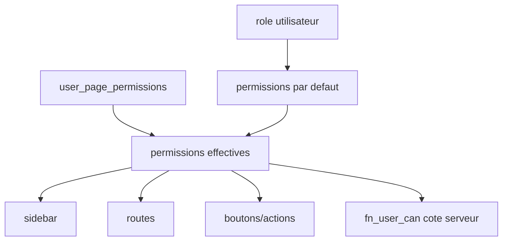

# RBAC et multi-tenant

Le RBAC de Samay Këur combine roles globaux, permissions par page et checks serveur.

## Roles

- `super_admin` : console globale et operations plateforme.
- `admin` : administration d'agence.
- `agent` : operations locatives.
- `comptable` : finance, encaissements, reporting.
- `bailleur` : acces proprietaire limite.

## Niveaux de permission

- `none`
- `read`
- `write`
- `admin`

Actions possibles :

- `create`
- `update`
- `delete`
- `export`
- `manage`

## Modele



## Frontend

Le frontend applique les permissions pour :

- masquer les pages interdites ;
- rendre certaines vues lecture seule ;
- retirer les boutons interdits ;
- proteger les routes ;
- adapter la navigation mobile.

Ces protections ameliorent l'UX mais ne suffisent pas.

## Backend

Les actions sensibles doivent verifier :

- utilisateur authentifie ;
- profil existant ;
- agence valide ;
- permission via `fn_user_can()` ;
- RLS sur la table cible.

## Multi-tenant

Regle : une requete doit toujours etre bornee par agence.

Exemples :

- `agency_id = profile.agency_id`
- chemin Storage `agencies/{agency_id}/...`
- permissions modifiables uniquement par admin de la meme agence.

## Type de compte vs role utilisateur

Ne pas confondre :

- type de compte : nature de l'espace (`agence`, bailleur individuel, gestionnaire, groupe) ;
- role utilisateur : droits de l'utilisateur dans cet espace (`admin`, `agent`, `comptable`, `bailleur`, etc.).

En Phase 1, un bailleur individuel est detecte via `agencies.is_bailleur_account = true`.

Important :

- un bailleur individuel peut etre traite comme administrateur effectif de son propre espace cote UI ;
- le role `bailleur` reste aussi utile pour un proprietaire invite dans une agence tierce ;
- les composants doivent demander des capacites (`features.canUseCommissions`, `features.canInviteTeam`) plutot que tester directement le role.

Helper principal :

```ts
getEffectiveRoleForAccount(profile.role, accountProfile)
```

## Checklist nouveau module

- Ajouter la page dans le catalogue permissions.
- Definir permission par defaut par role.
- Adapter sidebar et bottom nav.
- Proteger route.
- Masquer actions interdites.
- Ajouter check serveur si action sensible.
- Verifier RLS.
