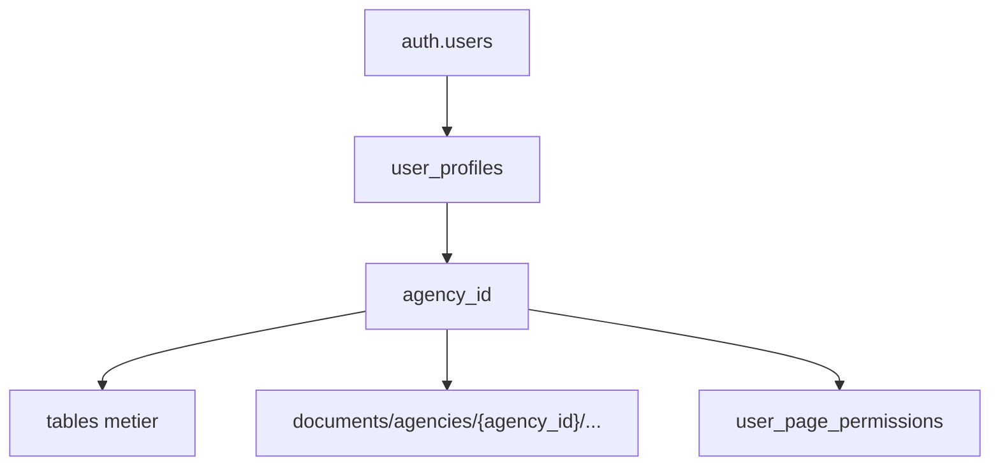

# Securite

La securite de Samay Keur repose sur quatre couches : Supabase RLS, Edge Functions, RBAC applicatif et controle strict des acces Storage.

## Principes

- Ne jamais faire confiance aux montants ou permissions envoyes par le frontend.
- Toujours verifier `agency_id` cote serveur.
- Utiliser `service_role` uniquement dans les Edge Functions.
- Garder les buckets sensibles prives.
- Journaliser les actions sensibles.
- Rotation obligatoire des secrets exposes pendant les phases de travail.

## Multi-tenant

Chaque ressource metier doit etre liee directement ou indirectement a une agence.

## RLS

Les policies doivent respecter ces regles :

- lecture limitee aux membres de l'agence ;
- ecriture limitee aux roles autorises ;
- permissions speciales pour `super_admin` uniquement si necessaire ;
- insertion financiere directe bloquee depuis le client quand une Edge Function existe.

## Edge Functions

Les fonctions critiques doivent :

- verifier l'utilisateur courant ;
- charger son profil et son agence ;
- appeler `fn_user_can()` quand une permission metier est necessaire ;
- valider les inputs ;
- utiliser le client service role seulement apres validation ;
- retourner des erreurs metier propres.

## Storage

Buckets sensibles :

- `documents` : prive, documents GED et documents generes.
- `agency-assets` : logos et assets agence.
- `agency-archives` : exports comptables et archives.

Regles :

- chemin prefixe par `agencies/{agency_id}/` quand applicable ;
- URLs signees pour l'ouverture ;
- pas d'URL publique pour documents critiques ;
- suppression brutale interdite pour les documents legaux critiques.

## Webhooks

PayDunya doit etre valide par :

- hash ou signature attendue ;
- token facture ;
- montant ;
- statut transaction ;
- idempotence contre retry fournisseur.

## Secrets

Secrets a proteger :

- Supabase service role ;
- PayDunya keys ;
- Resend API key ;
- Orange SMS credentials ;
- Sentry DSN si prive ;
- tokens de deploiement.

Avant production commerciale :

1. rotation des secrets exposes ;
2. verification Vercel env vars ;
3. verification Supabase secrets Edge Functions ;
4. audit des logs publics ;
5. verification des buckets prives.

## Checklist securite

- `npm run lint`
- `npm run typecheck`
- verifier RLS sur nouvelles tables
- verifier policies Storage
- tester acces croise entre deux agences
- tester utilisateur sans permission
- tester replay webhook double
- tester signed URL expiree
